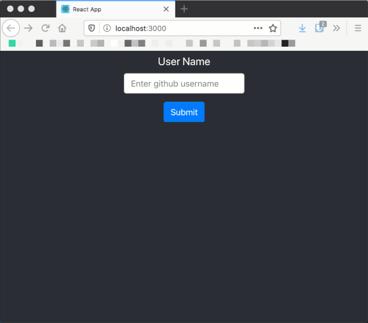

# github repo list

# Instructions
Développer une application qui recherche la liste des repos d'un utilisateur de github.
Pour faire la recherche, vous devez faire une requête externe à l'API de github.

# Requis technique
* Utilisation de la librairie axios pour faire la requête
* Utilisation de l'[API REST de github](https://developer.github.com/v3/)

# Élément fourni
Un squelette avec une requête axios est déjà présenté dans le [App.js](src/App.js).

# Demo

